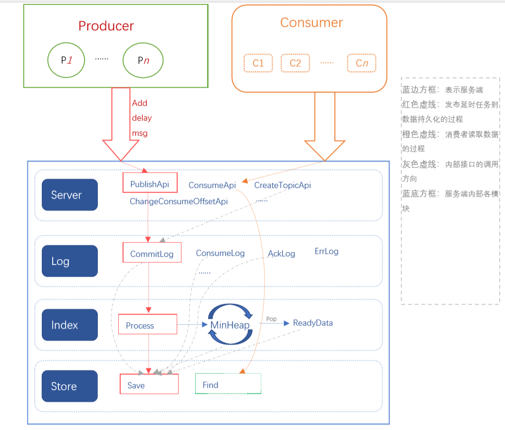

# 架构

`v1.0`@[hank](mailto:pavelhank@outlook.com)
---

在这里主要介绍下，服务端实现延时队列的架构，关于 Producer 和 Consumer 的相关描述稍后说明

## Server 模块
是 turtlemq 的出口，内部其他模块的服务能力，均通过这个模块对外提供访问，相应的鉴权等也包含在这一步。它是用户和队列交互的代理人。

## Log 模块
日志部分会选择将自用的内容持久化到文件中，其他日志可配置，比如只打印到标准输出，或到文件系统。为了完成数据持久化，我们将会在客户端提交延时数据后，先存储到 commitLog 中，然后有 Index 模块消费 CommitLog 数据，这样的目的是为了提高吞吐量。

## Index 模块
从 CommitLog 中消费日志，以消息可处理时间为Key，维护一个最小堆，定时检测最小堆的数据，及时将可消费数据状态修改成 Ready 状态。

## Store 模块
存储层，负责与持久化设备打交道，Index/Log/Server 等模块访问的都是 Store 模块提供的接口，Store 内部实现与不同持久化系统的交互逻辑。

有一个架构图大概如下：

